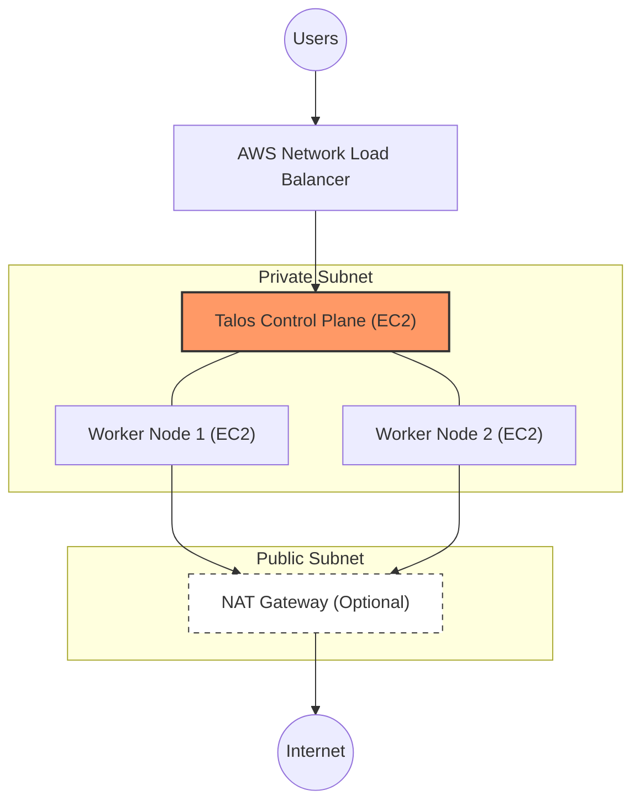

# Talos Linux AWS Kubernetes via Terraform

This repository contains Terraform code for deploying a production-ready, API-managed Kubernetes cluster on AWS using [Talos Linux](https://talos.dev).

---

## 🗺️ Infrastructure Topology

The following diagram illustrates the secure network layout. The Control Plane and Workers stay tucked away in private subnets, while traffic is managed via an AWS Network Load Balancer (NLB).



### Key Components Explained:

* **VPC (Virtual Private Cloud):** Your isolated network "fence" in AWS.
* **Control Plane:** The "Brain" of Kubernetes. Manages scheduling and cluster state.
* **Worker Nodes:** The "Muscle." This is where your actual application pods live.
* **Load Balancer:** The "Receptionist." It routes external user traffic into the cluster.
* **Talos Linux:** A security-focused, immutable operating system. **No SSH, no shell, no fluff.** It is managed entirely via an API.

---

## 🚀 Quick Start Guide

### 1. Prerequisites

Ensure you have the following tools installed:

* [Terraform](https://www.terraform.io/downloads) (v1.0+)
* [AWS CLI](https://aws.amazon.com/cli/) (Configured with valid credentials)
* [kubectl](https://kubernetes.io/docs/tasks/tools/)
* [talosctl](https://www.talos.dev/v1.7/introduction/getting-started/) (Required for cluster management)

### 2. Configure Your Cluster

Create a `terraform.tfvars` file to define your environment:

```hcl
region          = "ap-southeast-1"
project_name    = "talos-cluster"

# Cluster Sizing
control_plane_nodes = 1
worker_nodes_min    = 2
worker_nodes_max    = 5

# Instance Selection
control_plane_node_instance_type = "t3.small"
worker_node_instance_type        = "t3.small"

# Access Control (Restrict these in production!)
talos_api_allowed_cidr      = "0.0.0.0/0"
kubernetes_api_allowed_cidr = "0.0.0.0/0"

# Features
post_install = {
  argocd = {
    enabled = true
  }
}

```

### 3. Deploy

```bash
terraform init
terraform plan
terraform apply -auto-approve

```

*Deployment typically takes 5-10 minutes.*

### 4. Connect

Terraform will generate a `kubeconfig` and `talosconfig` in your local directory.

```bash
# Setup kubectl access
export KUBECONFIG=$(pwd)/kubeconfig

# Verify nodes are Ready
kubectl get nodes

```

---

## 🐙 Accessing ArgoCD (GitOps)

If enabled, ArgoCD is deployed automatically.

1. **Retrieve Admin Password:**
```bash
kubectl get secret argocd-initial-admin-secret -n argocd -o jsonpath="{.data.password}" | base64 -d && echo

```


2. **Get Load Balancer URL:**
```bash
kubectl get svc -n argocd argocd-server -o jsonpath='{.status.loadBalancer.ingress[0].hostname}'

```


3. **Login:** Use `admin` and the password from step 1 at the URL provided.

---

## 🛠️ Maintenance & Cleanup

| Task | Command |
| --- | --- |
| **Check Cluster Health** | `talosctl health --talosconfig talosconfig` |
| **View All Pods** | `kubectl get pods -A` |
| **Destroy Infrastructure** | `terraform destroy` |

---

*Built with ❤️ for simple, scalable, and secure Kubernetes.*

---

**Would you like me to add a "Known Issues" or "Cost Estimation" section to help users avoid unexpected AWS bills?**
